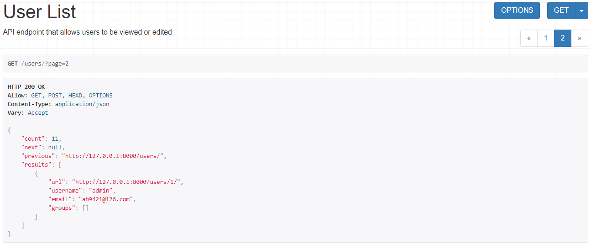

# django rest framework

我们将创建一个简单的 API，允许管理员用户查看和编辑系统中的用户和组。

## 项目设置

创建一个名为 tutorial 的 Django 项目，然后启动一个名为 quickstart 的新应用程序。

```shell
# Create the project directory
mkdir tutorial
cd tutorial

# Create a virtual environment to isolate our package dependencies locally
# python3 -m venv env
pipenv install
# source env/bin/activate  # On Windows use `env\Scripts\activate`
pipenv shell

# Install Django and Django REST framework into the virtual environment
pipenv install django
pipenv install djangorestframework

# Set up a new project with a single application
django-admin startproject tutorial .  # Note the trailing '.' character
cd tutorial
django-admin startapp quickstart
cd ..
```

项目布局应该是这样的:

```text
C:.
│  db.sqlite3
│  manage.py
│  Pipfile
│  Pipfile.lock
│  README.md
│
├─.vscode
│      settings.json
│
└─tutorial
    │  asgi.py
    │  settings.py
    │  urls.py
    │  wsgi.py
    │  __init__.py
    │
    └─quickstart
        │  admin.py
        │  apps.py
        │  models.py
        │  serializers.py
        │  tests.py
        │  views.py
        │  __init__.py
        │
        └─migrations
                __init__.py
```

在项目目录中创建应用程序可能看起来不寻常。使用项目的名称空间可以避免与外部模块的名称冲突(这个主题超出了快速入门的范围)。

现在首次同步你的数据库:

```shell
python manage.py migrate
```

我们还将创建一个名为 admin 的初始用户，其密码为 password123。我们将在后面的示例中作为该用户进行身份验证。

```shell
python manage.py createsuperuser --email admin@example.com --username admin
```

## Serializers 序列化器

首先，我们将定义一些序列化器。让我们创建一个名为 tutorial/quickstart/serializers.py 的新模块，用于数据表示。

```python
from django.contrib.auth.models import User, Group
from rest_framework import serializers


class UserSerializer(serializers.HyperlinkedModelSerializer):
    class Meta:
        model = User
        fields = ['url', 'username', 'email', 'groups']


class GroupSerializer(serializers.HyperlinkedModelSerializer):
    class Meta:
        model = Group
        fields = ['url', 'name']
```

注意，在这种情况下，我们使用超链接关系连接超链接 modelserializer。您还可以使用主键和各种其他关系，但是超链接是良好的 RESTful 设计。

## Views

好了，我们最好编写一些视图。打开 tutorial/quickstart/views.py 并输入。

```python
from django.contrib.auth.models import User, Group
from rest_framework import viewsets
from rest_framework import permissions
from tutorial.quickstart.serializers import UserSerializer, GroupSerializer


class UserViewSet(viewsets.ModelViewSet):
    """
    API endpoint that allows users to be viewed or edited.
    """
    queryset = User.objects.all().order_by('-date_joined')
    serializer_class = UserSerializer
    permission_classes = [permissions.IsAuthenticated]


class GroupViewSet(viewsets.ModelViewSet):
    """
    API endpoint that allows groups to be viewed or edited.
    """
    queryset = Group.objects.all()
    serializer_class = GroupSerializer
    permission_classes = [permissions.IsAuthenticated]
```

与编写多个视图不同，我们将所有常见的行为分组到称为 ViewSets 的类中。

如果需要的话，我们可以很容易地将这些视图拆分为单独的视图，但是使用视图集可以很好地组织视图逻辑，并且非常简洁。

## URLs 网址

好的，现在让我们连接 API url，在 tutorial/urls.py 文件中。

```python
from django.urls import include, path
from rest_framework import routers
from tutorial.quickstart import views

router = routers.DefaultRouter()
router.register(r'users', views.UserViewSet)
router.register(r'groups', views.GroupViewSet)

# Wire up our API using automatic URL routing.
# Additionally, we include login URLs for the browsable API.
urlpatterns = [
    path('', include(router.urls)),
    path('api-auth/', include('rest_framework.urls', namespace='rest_framework'))
]
```

因为我们使用的是视图集而不是视图，所以我们可以自动生成 API 的 URL conf，通过简单的在路由器类中注册视图集，。

同样，如果我们需要对 API URL 进行更多的控制，我们可以简单地下拉到使用普通的基于类的视图，并显式地编写 URL conf。

最后，我们将包括用于可浏览 API 的默认登录和注销视图。这是可选的，但是如果您的 API 需要身份验证并且您希望使用可浏览的 API，这将非常有用。

## Pagination 分页

分页使您可以控制每页返回多少对象。为了启用它，将以下行添加到 tutorial/settings.py

```python
REST_FRAMEWORK = {
    'DEFAULT_PAGINATION_CLASS': 'rest_framework.pagination.PageNumberPagination',
    'PAGE_SIZE': 10
}
```

## Settings 设置

将 rest_framework 添加到 INSTALLE_APPS 中。在 tutorial/settings.py 中设置模块

```python
INSTALLED_APPS = [
    ...
    'rest_framework',
]
```

## Testing our API 测试我们的 API

现在我们已经准备好测试我们构建的 API 了。

```shell
python manage.py runserver
```

我们现在可以通过命令行访问我们的 API，使用的工具包括 curl...

```shell

bash: curl -H 'Accept: application/json; indent=4' -u admin:password123 http://127.0.0.1:8000/users/
{
    "count": 2,
    "next": null,
    "previous": null,
    "results": [
        {
            "email": "admin@example.com",
            "groups": [],
            "url": "http://127.0.0.1:8000/users/1/",
            "username": "admin"
        },
        {
            "email": "tom@example.com",
            "groups": [],
            "url": "http://127.0.0.1:8000/users/2/",
            "username": "tom"
        }
    ]
}
```

或者使用 httpie，命令行工具...

```shell
bash: http -a admin:password123 http://127.0.0.1:8000/users/

HTTP/1.1 200 OK
...
{
    "count": 2,
    "next": null,
    "previous": null,
    "results": [
        {
            "email": "admin@example.com",
            "groups": [],
            "url": "http://localhost:8000/users/1/",
            "username": "paul"
        },
        {
            "email": "tom@example.com",
            "groups": [],
            "url": "http://127.0.0.1:8000/users/2/",
            "username": "tom"
        }
    ]
}
```

或者直接通过浏览器进入 URL http://127.0.0.1:8000/users/ ...


